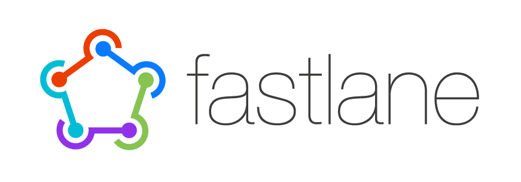

fastlane
============

[](https://twitter.com/FastlaneTools)
[](https://github.com/fastlane/fastlane/blob/master/LICENSE)
[](http://rubygems.org/gems/fastlane)

_fastlane_ is **the** tool to release your iOS and Android app :rocket: It handles all tedious tasks, like generating screenshots, dealing with code signing, and releasing your application.

TODO: Alternative

_fastlane_ is a tool for iOS, Mac, and Android developers to automate tedious tasks like generating screenshots, dealing with provisioning profiles, and releasing your application.

You create a so-called `Fastfile` in your repository, that defines how your beta or App Store release process:

```ruby
lane :beta do
  increment_build_number
  gym                       # Build your app
  testflight                # Upload to TestFlight
end

lane :appstore do
  snapshot                  # Generate screenshots for the App Store
  gym                       # Build your app
  deliver                   # Upload the screenshots and the binary to iTunes
  slack                     # Let your team-mates know the new version is live
end
```

You just defined 2 different lanes, one for beta deployment, one for App Store. To release your app in the App Store, all you have to do is

```no-highlight
fastlane appstore
```

## Why fastlane?

 |
-------------- | ----------
🚀 | Save **hours** every time you push a new release to the store or beta testing service
✨ | Integrates with all your existing tools and services (170 actions currently)
📖 | 100% open source under the MIT license
🎩 | Easy setup assistant to get started in a few minutes
⚒ | Runs on **your** machine, it's your app and your data
👻 | Integrates with all major CI systems
🖥 | Supports iOS, Mac, and Android apps
🔧 | Extend and customise _fastlane_ to fit your needs, you're not dependent on anyone
💭 | Never remember any commands any more, just _fastlane_
🚢 | Deploy from any computer, including a CI server

## Getting Started

Make sure you have the latest version of the Xcode command line tools installed:

```no-highlight
xcode-select --install
```

### Using the terminal

```no-highlight
sudo gem install fastlane --verbose
```

Navigate to your iOS or Android app and run

```no-highlight
fastlane init
```

_fastlane_ will automatically detect your project, and ask for any missing information.

For more details about how to get up and running, check out the getting started guides:

- [fastlane Getting Started guide for iOS](getting-started/ios/setup.md)
- [fastlane Getting Started guide for Android](getting-started/android/setup.md)

### Using the Fabric app

If you're not familiar with the terminal and prefer a graphical user interface, download the [Fabric app](https://get.fabric.io/) and use the built-in _fastlane_ button.

## Questions and support

All fastlane related questions, problems and feature ideas should be posted as [GitHub issue](https://github.com/fastlane/fastlane/issues/new). This way, other users can search existing discussions, and everybody can jump in.

## System requirements

_fastlane_ requires macOS or Linux with Ruby 2.0.0 or above

## Code of Conduct

Help us keep _fastlane_ open and inclusive. Please read and follow our [Code of Conduct](https://github.com/fastlane/fastlane/blob/master/CODE_OF_CONDUCT.md).

## License

This project is licensed under the terms of the MIT license. See the [LICENSE](LICENSE) file.

> This project and all fastlane tools are in no way affiliated with Apple Inc or Google. This project is open source under the MIT license, which means you have full access to the source code and can modify it to fit your own needs. All fastlane tools run on your own computer or server, so your credentials or other sensitive information will never leave your own computer. You are responsible for how you use fastlane tools.
